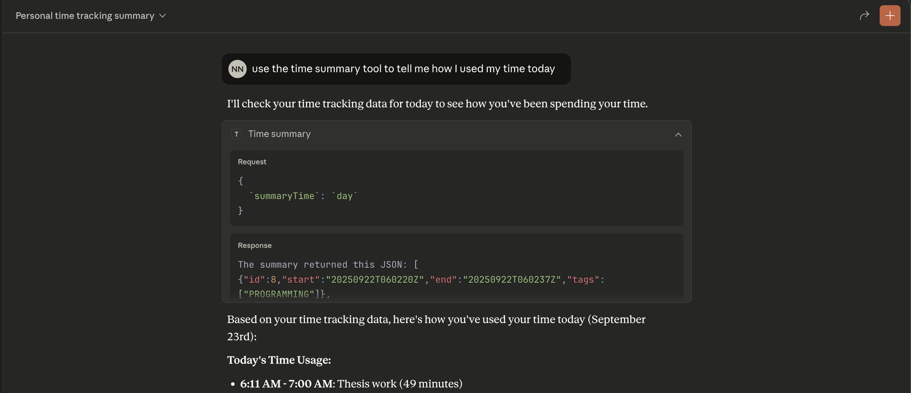

# README

My try to write a simple mcp server and access it with claude code desktop on Mac.
Currently it works when configured right.



## Ideas

- [ ] can I build a little super simple mcp library that abstracts away the initialization and other
      unimportant recurring parts of the message so that anyone can recreate an mcp with only the bare
      tools functions and the params and name

## TODO

- [x] write the handshake
- [x] tool discovery
  - [x] test
  - [x] implementation
- [x] tool call
- [x] hook the timew integration
- [ ] client capabilities are hard-coded empty
- [ ] error handling is a mess
- [ ] fix too many arguments for the handler function

## Useful resources

- `tail -n 20 -f ~/Library/Logs/Claude/mcp*.log`
- [connect to local server](https://modelcontextprotocol.io/docs/develop/connect-local-servers#getting-logs-from-claude-desktop)
- [documentation](https://modelcontextprotocol.io/docs/learn/architecture)

```
{
  "mcpServers": {
    "timewarrior": {
      "command": "path/to/your/server/_build/default/bin/main.exe",
      "args": []
    }
  }
}
```
